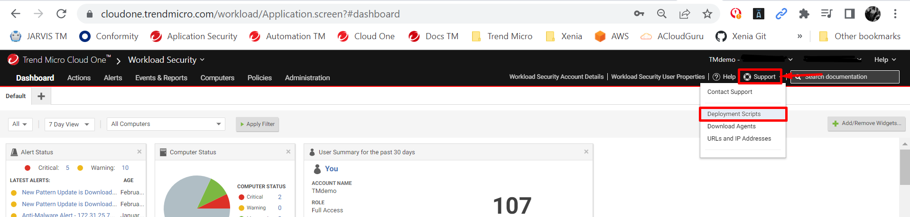
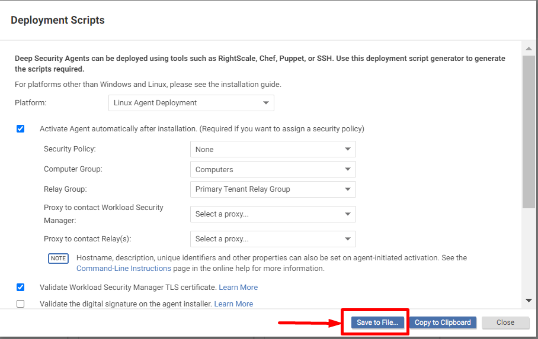
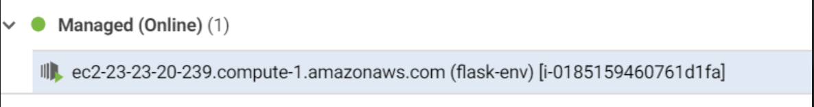

# How to add Trend Micro Workload Security/Deep Security Agent in AWS Elastic Beanstalk Instances

## Description 

This is a Simple Step-By-Step of how install Trend Micro Workload Security Automatically in AWS Elastic Beanstalk Environment, using Elastic-Beanstalk extensions to Run de Deployment Script.

- > This guide may Works in Cloud One Workload Security or Deep Security as a Service, - For On-premise Environment we need to consider other things that for moment aren't include in this article.

## Requirements
- Cloud One Workload Security active console (Deep Security as a Service works too)
- AWS Bucket S3
- AWS Elastic Beanstalk Application [You can use this examples app for Testing](https://docs.aws.amazon.com/elasticbeanstalk/latest/dg/tutorials.html)
- AWS ElasticBeanstalk CLI (**Optional**) - [EB Cli Installation](https://docs.aws.amazon.com/elasticbeanstalk/latest/dg/eb-cli3-install.html)

## Steps
1) Login in Cloud One Workload Security/Deep Security as a Service console 

2) Download the Deployment Script specific for your platform (*The default name for file are AgentDeploymentScript.sh but you can change if want*)

    - > For now this guide only cover the deployment for Linux Platforms.

3) Save the previous file in compressed file like this:
    *ds_agent_script.tar.gz*

4) Upload compressed file created in previous step this file to your AWS S3 Bucket.

5) Configure AWS Elastic Beanstalk extensions
    - > For this guide we use EB Cli for Deployment

    a. Create the ebextensions folder if not exists
        
        mkdir .ebextentions
    b. Create config file inside eb extensions folder

        touch ds_agent.config 
        
    - > You can use any name for file only *.config* extension is required

    c. In the *.config* file you need to write the next code
        
        sources:
            /tmp: https://<S3_BUCKET_NAME>/ds_agent_script.tar.gz
        commands:
            ds-install:
                command: /tmp/<DeploymentScriptName>.sh

    - > Please replace <S3_BUCKET_NAME> and <DeploymentScriptName> with your values
    d. Save the file

6. Update your deployment

        eb deploy 

7. Verify in Cloud One Workload Security/Deep Security as a Service console the agent are activated and you can configure the policy, task, scan, etc.

----
I leave in this repository and example aplication for you can verify the configuration.

----
### How to contribute
🎉 Thank you for taking the time to contribute! 🎉

Fork this repository.

Commit your code with a message that is structured according to the Conventional Commits specification.

Submit a PR with the information requested in PR template.

git reset --soft HEAD~3
git commit -m "feat: Add some cool stuff"
Tip: Backup your branch before you try new things.
